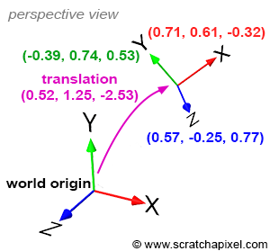
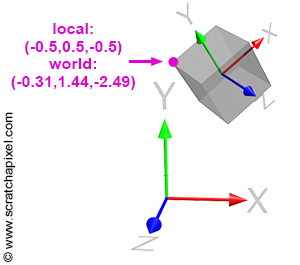
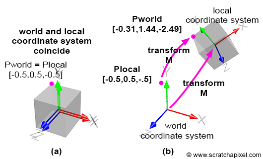
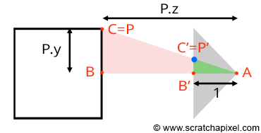
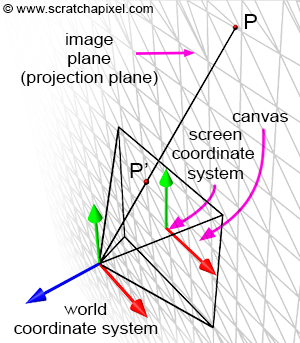
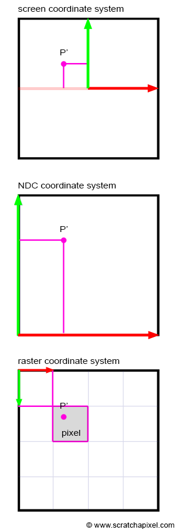

# 개요

이 글에서는 3차원 좌표 형태로 주어진 점을 스크린 위의 2차원 좌표로 투영하는 법을 다룬다.

# 좌표계란

점에 대해 얘기할 때, 이 점이 *월드 공간*이라는 곳에 존재한다고 생각하자. 월드 공간이란 `(0, 0, 0)`의 월드 원점을 기준으로 3개의 직교하는 좌표축이 존재하고 모든 점이 그로부터 `(x, y, z)`로 표현되는 거리 상에 있다고 정의된 공간이다.

## 4x4 행렬과 직교 좌표계

3차원 물체는 3가지 연산을 통해 변형될 수 있다.

- 평행 이동: Translation
- 회전: Rotation
- 크기 조절: Scale

이 3가지 연산, 그리고 이 연산들의 조합을 선형적 변형(Linear Transformation)이라고 한다. 선형적 변형은 4x4 크기의 행렬을 곱하는 것으로 표현할 수 있다. 아래 행렬에서 우측 하방 대각선을 따라 첫 3개의 수는 크기 조절, 맨 아랫줄의 좌측부터 첫 3개 수는 평행 이동, 좌측 상단의 3x3 구역의 수는 회전을 나타낸다.

```
| c00 c01 c02 c03 |  ->  x축
| c10 c11 c12 c13 |  ->  y축
| c20 c21 c22 c23 |  ->  z축
| c30 c31 c32 c33 |  ->  이동

c00, c11, c22: 크기 조절
c30, c31, c32: (평행)이동
c00, c01, c02, c10, c11, c12, c20, c21, c22: 회전
```

첫 세줄에서 회전을 담당하는 수와 크기 조절을 담당하는 수들이 겹치기 때문에 행렬을 직접 읽고 이들의 역할을 유추하는 것은 어렵다. 따라서 지금부터는 크기를 조절하는 연산은 일단 무시하고 회전과 이동 연산에만 집중하도록 한다.



월드 공간을 정의하는 원점과 좌표축 방향을 설정하면 그 지점을 이동하고 화전시켜서 임의의 새로운 좌표계를 정의할 수 있다. 이는 월드 공간을 기준으로 상대적으로만 존재할 수 있다. *그림 4*에서 볼 수 있듯이 보라색으로 나타낸 값은 원점을 얼마나 이동시켰는지 나타내고 각각 빨간색, 녹색, 파란색으로 나타낸 값은 `x`, `y`, `z축`의 방향(벡터)를 뜻한다. 이들은 모두 단위 벡터임에 유의하라.

위 4x4 행렬에서 좌측 상단의 3x3 구역의 수들은 *그림 4*에서 `x`, `y`, `z축`의 벡터를 나타낸다. 그리고 마지막 줄의 첫 3개의 수는 월드 원점으로부터 새로운 좌표계가 이동한 방향을 나타낸다. 즉 *그림 4*에서 생성된 새로운 좌표계는 다음의 행렬로 나타낼 수 있다.

```
|  0.71  0.61 -0.32  0.00 |  -> x축 벡터
| -0.39  0.74  0.53  0.00 |  -> y축 벡터
|  0.57 -0.25  0.77  0.00 |  -> z축 벡터
|  0.52  1.25 -2.53  1.00 |  -> 원점 좌표
```

결론적으로, 앞으로 사용할 4x4 행렬은 월드 공간을 기준으로 새로운 좌표계를 정의하는 방법일 뿐이다. 4x4 행렬을 다른 것이 아니라 단지 하나의 좌표계라고 받아들이는 것이 중요하다. 반대로 어떤 좌표계를 정의하려면 4x4 행렬이 필요하다는 점 또한 명심해야 한다.

## 지역 좌표계 vs 글로벌 좌표계

4x4 행렬로 지역 좌표계를 표현하는 방법을 알아 보았으니 지역 좌표계가 왜 필요한지 다시 짚어보도록 한다. 기본적으로 어떤 3차원 점의 위치는 월드 좌표계를 기준으로 정의된다. 이 월드 좌표계라는 것은 단지 무수히 많은 좌표계 중 기준으로 삼을 임의의 좌표계일 뿐이다. 기준이 존재해야 그를 기준으로 다른 위치를 정의할 수 있기 때문이다.

다만 기준 좌표계가 단 하나일 경우 불편한 점이 있을 수 있다. 집의 위치를 찾을 때 물론 GPS를 통해 위도 경도를 알아내 찾을 수도 있다. 하지만 당신이 이미 집이 있는 거리를 걷고 있다면, 집의 번호를 알아야 더욱 쉽고 빠르게 집을 찾을 수 있다. 이때 집의 번호(강남대로 327)는 지역 좌표계요, 집의 위도 경도는 글로벌 좌표계다. 지역 좌표계는 그 사물이 있는 정황 속에 들어가 사물을 찾을 시에 유용하다. 이때 지역 좌표계는 글로벌 좌표계에 상대적으로 정의된다는 점에 유의하라. 컴퓨터 그래픽스에서도 어떤 사물의 위치를 글로벌 좌표계를 통해 표현할 수도 있지만 지역 좌표계를 사용하는 것이 편리한 경우가 더 많다.

3차원 공간에서 물체를 움직일 때, 이 물체를 원점으로부터 얼마나 돌려서 어느 방향으로 얼만큼 이동시켰는지(즉 Translation, Rotation, Scale의 3 연산)는 항상 4x4 행렬을 사용하여 표현할 수 있다. 이때 이 행렬은 이 물체가 존재하는 지역 좌표계를 정의한다고 생각할 수도 있다. 그렇다면, **이 물체를 구성하는 점들은 지역 좌표계상에서 표현할 수 있으므로, 물체가 글로벌 좌표계 상에서 이동한 것이 아니라, 좌표계 자체를 글로벌에서 지역으로 옮긴 것으로 생각할 수 있다.** 하지만 그렇다고 실제로 좌표계 자체가 변형된 것은 아니다. 이동, 크기조절, 회전이 일어난 것은 어디까지나 물체고, 어떻게 변형이 일어났는 지 4x4 행렬을 통해 표현할 수 있다. 그리고 그 행렬을 시각화시키는 방법이 바로 지역 좌표계다.

### 다른 좌표계상에서의 점의 위치 표현



같은 집의 위치를 표현하더라도 좌표계가 다르다면 다른 주소로 표현해야 한다. *그림 6*에서 표시된 점은 지역 좌표계에서 `(-0.5, 0.5, -0.5)`로 표현되지만 월드 (글로벌) 좌표계에서는 `(-0.31, 1.44, -2.49)`의 위치를 가지고 있다. 같은 점이라도 좌표계가 달라지면 얼마든지 다른 좌표로 표현될 수 있다.

앞서 언급하였듯이 월드 좌표계보다 지역 좌표계를 사용할 때 위치를 설명하기 더욱 편리한 경우가 많다. *그림 6*의 정육면체의 꼭짓점을 설명할 때가 그렇다. 하지만 한 점의 좌표를 다른 좌표계로 변환하려면 어떻게 해야 할까? 만약 갑 좌표계에서 을 좌표계로 변환하는 4x4 행렬을 알고 있을 때 갑 좌표계상에 존재하는 점의 좌표를 을 좌표계에서 표현하고 싶다면, 단순히 좌표에 그 행렬을 곱하면 된다.  을 좌표계상의 좌표를 갑 좌표계로 변환하고 싶다면 그 행렬의 **역행렬**을 구한 후, 그를 곱하면 된다.

예를 들어 *그림 6*의 지역 좌표계의 행렬 M은 다음과 같다.
```
[행렬 M] = 
|  0.71  0.61 -0.32  0.00 |  -> x축 벡터
| -0.39  0.74  0.53  0.00 |  -> y축 벡터
|  0.57 -0.25  0.77  0.00 |  -> z축 벡터
|  0.52  1.25 -2.53  1.00 |  -> 원점 좌표
```

초기에는 *그림 7a*와 같이 지역 좌표계가 월드 좌표계와 일치한다. 이때 행렬 M을 지역 좌표계에 곱하여 변환시키면 *그림 7b*와 같이 좌표계가 이동하고, 크기가 조절되고, 회전한다. 즉 변환을 적용하기 전에는 *그림 6, 7*의 자주색 점의 좌표가 일치했지만 변환 후에는 일치하지 않는다. 이 점의 지역 좌표는 여전히 `(-0.5, 0.5, -0.5)`이지만 월드 좌표는 변환을 거쳐 달라져 버렸다. 이 점의 **월드 좌표**를 구하기 위해서는 **지역-월드 변환 행렬** (**local-to-world matrix**)을 이 점의 좌표에 곱해야 한다. 여기서는 행렬 M이 지역-월드 변환 행렬이다. 

원래 월드 좌표계상에 존재하던 정육면체를 행렬 M을 사용하여 옮겼으니, 그에 반대되는 행렬을 곱해야 제자리로 돌아갈 수 있을 것이다. 이 행렬은 다음과 같이 표현된다.

```
P(world) = P(local) * M
P(local) = P(world) * M의 역행렬
```

그러므로 `M의 역행렬`은 **월드-지역 변환 행렬** (**world-to-local matrix**)라고 칭할 수 있다. 검증을 위해 위 예시를 보면, *그림 7*에서 자주색 점의 지역 좌표는 `(-0.5, 0.5, -0.5)`, 월드 좌표는 `(-0.31, 1.44, -2.49)`이다. `행렬 M(local-to-world)` 또한 알려져 있다. 이 행렬을 지역 좌표에 곱하면 월드 좌표가 나와야 한다.
```
P(world) = P(local) * M
P(world).x = P(local).x * M00 + P(local).y * M10 + P(local).z * M20 + M30
P(world).y = P(local).x * M01 + P(local).y * M11 + P(local).z * M21 + M31
P(world).z = P(local).x * M02 + P(local).y * M12 + P(local).z * M22 + M32
```
이는 다음과 같은 코드로 검증할 수 있다.
```Cpp
Matrix44f m(0.718762, 0.615033, -0.324214, 0, -0.393732, 0.744416, 0.539277, 0, 0.573024, -0.259959, 0.777216, 0, 0.526967, 1.254234, -2.53215, 1); 
Vec3f Plocal(-0.5, 0.5, -0.5), Pworld; 
m.multVecMatrix(Plocal, Pworld); 
std::cerr << Pworld << std::endl; 
```
결과는 다음과 같다.
```
(-0.315792 1.4489 -2.48901) 
```

반대로 이 점의 월드 좌표를 지역 좌표로 변환하기 위해서는 다음과 같은 코드가 필요하다. 예제에서 사용된 행렬 클래스에는 역행렬을 구하는 메소드가 구현되어 있다. 이것을 이용해 월드-지역 변환 행렬을 구한 후 월드 좌표에 이를 곱한다.
```Cpp
Matrix44f m(0.718762, 0.615033, -0.324214, 0, -0.393732, 0.744416, 0.539277, 0, 0.573024, -0.259959, 0.777216, 0, 0.526967, 1.254234, -2.53215, 1); 
m.invert(); 
Vec3f Pworld(-0.315792, 1.4489, -2.48901), Plocal; 
m.multVecMatrix(Pworld, Plocal); 
std::cerr << Plocal << std::endl; 
```
결과는 다음과 같다.
```
(-0.500004 0.499998 -0.499997) 
```

# 카메라 좌표계와 카메라 공간

컴퓨터 그래픽스에서 카메라는 다른 물체와 다르지 않다. 사진을 찍을 때 카메라를 움직이고 돌려야 하듯이 컴퓨터 그래픽스에서 가상의 카메라를 움직이고 돌릴 때 일어나는 일은 사실 그 카메라가 가진 지역 좌표계를 변형하는 것과 같다(이때 평행이동, 회전, 크기조절 중 카메라의 크기를 조절하는 것은 올바르다고 볼 수 없으므로 무시한다). CG에서는 이것을 공간 참조 체계 (spatial reference system) 또는 **카메라 좌표계** (**camera coordinate system**)이라고 한다.

즉 카메라는 곧 좌표계일 뿐이며 앞서 살펴본 점의 좌표계를 변환하는 방법을 여기서도 사용할 수 있다. 

이때 카메라는 항상 월드 좌표계의 z축의 반대 방향 (-z 방향)을 바라보고 있다는 점에 주목한다. 이렇게 하면 어떤 점을 월드 공간에서 카메라 공간으로 변환했을 때, 점이 y축 기준으로 왼쪽에 있다면 카메라 공간에서도 y축 왼쪽에 나타난다. 다르게 말하자면 월드의 x축이 우측을 향한다면 카메라의 x축도 우측을 향해야 한다. 카메라가 z축 반대방향으로 향해야만 이러한 효과가 생겨난다.

이때문에 좌표를 변환할 때 z 좌표의 부호가 바뀐다. 추후 이 특성이 중요하게 작용하므로 이를 명심하도록 한다.

결론적으로 월드 공간상의 점을 지역 공간으로 옮기고 싶다면 지역-월드 변환 행렬의 역행렬을 곱하면 된다.

## 카메라 공간의 중요성

한 점을 스크린에 투영하기 위해서는 점을 월드 공간에서 카메라 공간으로 변형해야 한다. 이때 스크린은 CG에서 캔버스, 투영 평면(projection plane), **이미지 평면**(**image plane**) 등으로 불리기도 한다.



우리의 목적은 *그림 10*에서 `P'`를 구하는 것이다. `점 P'`는 `점 P`에서 카메라의 중심으로 선분을 그었을 때 캔버스와 선분이 교차하는 점이다. `점 P`의 좌표를 카메라 공간을 기준으로 알 수 있다면, `P'`의 좌표를 구하는 것은 매우 쉽다. *그림 10*은 카메라가 물체를 찍는 장면을 옆에서 바라본 것인데, 이때 `삼각형 ABC`와 `AB'C'`는 닮은 꼴이다(`A`는 카메라 원점, `C`는 `P`이다. 이때 `AB'`의 길이는 계산의 편의를 위해 `1`로 가정한다). 두 삼각형이 닮았으므로 다음의 식도 성립한다.
```
BC / AB = B'C' / AB'
```
캔버스가 원점에서 `1` 떨어져 있으므로 `AB' = 1`이다. `B`는 `점 P`의 `z` 좌표(깊이)이고 `C`는 `y` 좌표(높이)이다. 위 식에서 해당 값들을 대체하면 다음의 식이 나온다.
```
P.y / P.z = P'.y / 1
P'.y = P.y / P.z
```

이는 컴퓨터 그래픽스에서 가장 기초가 되는 식으로 **z divide** 혹은 **perspective divide**라고 불린다. 같은 원리로 `x` 좌표 또한 구할 수 있다. 
```
P'.y = P.y / P.z
P'.x = P.x / P.z
```

물론 위 식이 성립하기 위해서는 `P`가 카메라 좌표계에 있어야 한다. 다만 3D 물체는 원래 월드 좌표계에서 정의되기 때문에 앞서 언급한 모든 과정이 일어나기 위해서는 먼저 모든 좌표값을 카메라 좌표계로 변환해야 하고, 이를 위해 카메라를 정의하는 4x4 행렬이 필요하다. 이는 카메라-월드 변환 행렬이므로 이것의 역행렬을 구해서 월드-카메라 행렬로 사용한다.

```
P(camera) = P(world) * M(world-to-camera)
```
이 과정을 먼저 거친 후에야 P'의 좌표를 구할 수 있다.
```
P'.y = P(camera).y / P(camera).z
P'.x = P(camera).x / P(camera).z
```
기본적으로 카메라는 월드 `z`축의 반대 방향을 바라보고 있으므로 점을 카메라 좌표계로 변환할 시 `z` 좌표의 부호가 바뀌는 점을 명심해야 한다. **카메라에 점이 보이려면 카메라 공간에서 점의 z 좌표가 음수여야 한다.** 그러므로 캔버스에 나타나는 점들의 `x`, `y`좌표도 음수인 `z`좌표가 곱해져 부호가 반전되게 된다. 즉 카메라 원점을 기준으로 캔버스 상에서 모든 점의 위치가 반전되어 나타나게 된다. 이 문제는 자연스러운 것이며 단순히 부호를 한번 더 반전시키는 것으로 해결하면 된다.

```
P'.y = P(camera).y / -P(camera).z
P'.x = P(camera).x / -P(camera).z
```

### 중간 요약

점은 기본적으로 월드 좌표계를 기준으로 표현한다. 이들을 캔버스에 투영하려면

- 월드 공간에서 카메라 공간으로 좌표를 변환한다.
  - camera-to-world 행렬의 역행렬을 곱한다.
- 캔버스 기준 2차원 좌표로 변환한다.
  - 원근 투영 공식 (z 좌표로 나누고 부호 반전)을 적용한다.

```Cpp
// 예제
Matrix44f cameraToWorld(0.718762, 0.615033, -0.324214, 0, -0.393732, 0.744416, 0.539277, 0, 0.573024, -0.259959, 0.777216, 0, 0.526967, 1.254234, -2.53215, 1); 
Matrix4ff worldToCamera = cameraToWorld.inverse(); 
Vec3f Pworld(-0.315792, 1.4489, -2.48901), Pcamera; 
worldToCamera.multVecMatrix(Pworld, Pcamera); 
std::cerr << Pcamera << std::endl; 
```

# 스크린 공간에서 래스터 공간으로

우리는 이제 점을 캔버스에 투영하는 법을 알고 있다. `점 P`를 캔버스에 투영한 결과가 `P'`라고 한다면, `P'`의 좌표계는 어떻게 정의할 수 있을까? 캔버스는 평면이기 때문에 `P'`의 `z` 좌표는 더 이상 중요하지 않다. 따라서 `P'`를 2차원 점으로 간주해도 무방하되 `z`의 부호에 따라 카메라가 이를 볼 수 있는지가 결정되므로 완전히 무시하지는 않도록 한다.



*그림 11*에서 나타난 이미지 평면은 무한하지만, 캔버스 (스크린)은 유한하다. 캔버스의 크기는 임의로 지정할 수 있다. 이 상황에서는 2개의 축과 평행한 너비와 높이를 지정할 수 있고 축의 길이는 단위길이와 같다고 정의한다.



`P'`는 2차원 점이기 때문에 **이미지(스크린) 좌표계**를 통해 표현할 수 있다. 이 좌표계에서는 캔버스의 **중앙**을 원점으로 삼고 그 위의 모든 점은 원점을 기준으로 좌표를 측정한다. 투영된 좌표값이 캔버스 높이/너비의 절반을 넘어갈 경우 화면에서 보이지 않게 된다.

투영된 점을 실제로 디스플레이에 표시하기 위해 픽셀로 변환할 때 **래스터 좌표계**를 적용하게 된다. 래스터 좌표계에서는 원점이 **좌측 상단**이며 x축은 오른쪽, y측은 아래 방향이다.

이미지 좌표계상의 점을 래스터 좌표계로 변환하기 위해서는 간단한 비례식을 사용하면 된다. 먼저 `P'`의 좌표값을 `[0, 1]`범위로 매핑한다.

```
P'normalized.x = (P'.x + width / 2) / width
P'normalized.y = (P'.y + height / 2) / height
```
이때 `P'normalized`의 좌표값은 항상 `0`보다 크고 `1`보다 작다. 이 좌표계를 **NDC(Normalized Device Coordinate) 좌표계**라고 한다. 이 좌표계의 원점은 **좌측 하단**이다. 다음으로 이 값을 실제 이미지의 픽셀 좌표로 변환하면 된다. 이미 정규화된 값이므로 단순히 픽셀들의 너비/높이를 곱하면 된다.

```
P'raster.x = P'normalized.x * 픽셀 높이
P'raster.y = (1 - P'normalized.y) * 픽셀 높이
```
이때 NDC 좌표계와 래스터 좌표계의 `y`축 방향이 반대이기 때문에 `1`에서 `y 좌표값`을 먼저 뺀 후 변환을 행해야 한다.

# 총 요약

- 3차원 공간의 점은 기본적으로 월드 공간에 존재한다.
- 4x4 행렬은 지역 좌표계를 표현하는 수단이다.
- 월드 좌표계의 점을 지역 좌표계로 변환하려면 지역-월드 변환 행렬을 구한 후 이의 역행렬을 구해 월드 좌표값에 곱하면 된다.
- 4x4 행렬로 카메라 좌표계를 정의할 수 있다.
  - 즉 임의의 월드 공간 점을 카메라 공간으로 변환할 수 있다.
- 카메라 공간 안의 점에 원근 투명 공식을 적용해 캔버스 좌표계로 변환할 수 있다.
  - `z` 좌표로 `x`, `y` 좌표를 나눈 뒤 부호를 바꾼다.
  - `z` 좌표가 양수라면 카메라에게 보이지 않는다.
- 캔버스 -> NDC -> 래스터 좌표계 순으로 좌표를 변환한다.
  - 캔버스 좌표계
    - `[-너비/2, +너비/2]`, `[-높이/2, 높이/2]`의 범위를 가진다.
    - `원점`은 중앙, `x축`은 오른쪽, `y축`은 위쪽
  - NDC 좌표계
    - `[0, 1]`, `[0, 1]`의 범위를 가진다.
    - `원점`은 좌측 하단, `x축`은 오른쪽, `y축`은 위쪽
  - 래스터 좌표계
    - `[0, 너비]`, `[0, 높이]`의 범위를 가진다.
    - `원점`은 좌측 상단, `x축`은 오른쪽, `y축`은 아래쪽